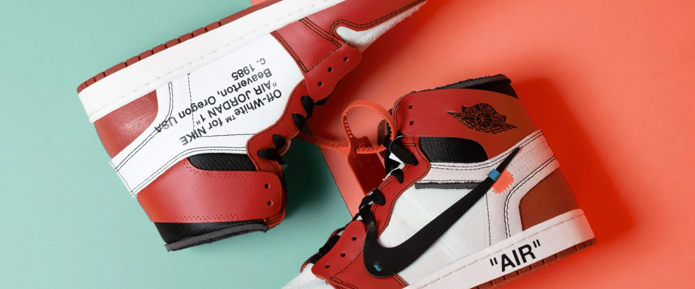

# StockX Sneaker Market Analysis (2019)

A data science analysis of the sneaker resale market using 2019 StockX transaction data. This project analyzes ROI, pricing patterns, and market efficiency across different brands and models.

### Technologies Used
- Python 3.8
- Pandas, NumPy for data manipulation
- Scikit-learn for clustering analysis
- Matplotlib, Seaborn for visualization

### Key Findings
- Off-White collaborations dramatically outperformed other brands (313% ROI vs 75% for Yeezy)
- Premium market segment exhibits stronger risk-adjusted returns (Sharpe Ratio: 4.87)
- Optimal holding period identified as 4-14 months post-release

### Brand Performance
|   Brand   |   ROI   | Sale Price |  Profit | Unique Models |
|-----------|---------|------------|---------|---------------|
| Off-White | 313.48% |  $728.88   | $545.65 |       25      |
| Yeezy     | 74.97%  |  $384.06   | $164.22 |       18      |

